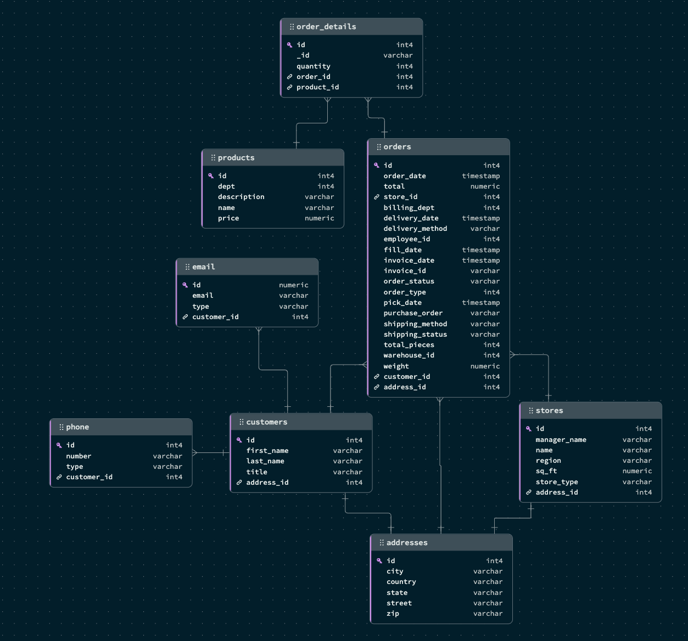
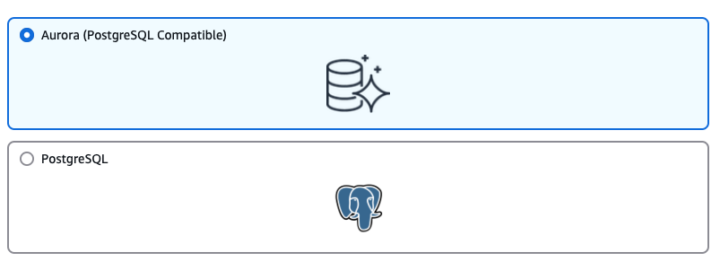
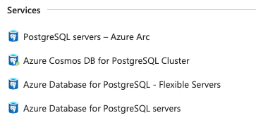

# How to Demo

Open your browser to    http://localhost:8080/index.html  This should load a page that looks like this.
You can also use the Kanopy deployed version found at https://rdbms-comparator.sa-demo.staging.corp.mongodb.com/

## Key Concepts

There are a few key concepts that the demo is designed to be able to highlight. 

- [Developer friendly nature of the document model when compared to RDBMS systems.](#developer-friendly-benefits-of-the-document-model-) 
- [Performance advantages of removing unncessary joins](#performance-benefits)
- [Developer Data Platform benefits of having features like Atlas Search included]
- Run anywhere. 

## How to show each differentiator

### Developer friendly benefits of the document model. 

One of the key highlights of the document model is the developer friendly nature and how easily the document model maps to objects in Code. 

While we have traditionally talked about ORM's (or Object Relational Mappers) as bad things, tools like Spring-Data are some of the most common frameworks our customer use. You can use this demo to highlight some of the complexity that RDBMS systems bring, even when using these tools
with this demo. 

Start with reviewing the Data Models for Postgres and MongoDB. You can find images of those in the IMG folder or view them below. 


It takes 8 tables to create the schema for the necessary data in Postgres. Specifically focus on the Customer table and it's dependencies on:
- Address
- Phone
- Email

A single customer has 1 associated address, and can have multiple associated phone numbers and email addresses.  From a schema perspective it doesn't look overly complicated, but lets view it in the Spring-Data code. 

Open up the source code file for [Customer.java](src/main/java/com/mdb/rdbms/comparator/models/Customer.java). 

Start by looking at the annotations at the top. 

```java
@Entity()
@Table(name = "customers", indexes = {
    @Index(name = "first_last_idx", columnList = "firstName, lastName DESC")
})
@BatchSize(size=50)

```
All of these are the necessary annotations to help tell Spring-Data what table to map the Object to, entries to try to have it create and manage the indexes on the table
and to set a BatchSize to help improve performance and control how many sub-entites it can fetch at a time. 

Additionally these entries are required to support the mapping of the address, phone, and email objects. 

```java

    @OneToMany(cascade = CascadeType.ALL, orphanRemoval = true, fetch = FetchType.EAGER)
    @JoinColumn(name="customer_id", referencedColumnName="id")
    List<Phone> phones = new ArrayList<>();

    @OneToMany(cascade = CascadeType.ALL, orphanRemoval = true, fetch = FetchType.EAGER)
    @JoinColumn(name="customer_id", referencedColumnName="id")
    List<Email> emails = new ArrayList<>();

    @OneToOne
    @JoinColumn(name="address_id")
    Address address;

```
None of the config items are required to support MongoDB. In fact that only entries MongoDB requires are

```java

    @Document("customers")
    public class Customer {
    
    // Can use either of these annotations.  @MongoId is useful in this case when the ID between objects is different. 
    @Id
    @MongoId
    String _id;

```

No additional work to support the nested objects. They are embedded so they are assumed to be treated as embedded documents or objects in side the Customer object. 

#### Address Specific Things ####

In reviewing the data model notice that the Address table is a 1:1 with Customer. But it's also in a 1:1 with Store, and has a relationship with Shipment. 
The Address table is broken out to it's own to avoid data duplication, which is a standard thing in RDBMS designs. But due to the nature of the relationship, when you configure it in Spring you 
end up with a situation where its modeled more as a Address has a Customer instead of a Customer having an address.  

You can see this in the fact that address_id is a field in the customer table instead of having customer_id be in the address table. (like it is with Phone or Email). 

That creates it's own complications when trying to save the object. You can't just take in a fully populated Customer object (including Address) and call ` save(customer)` and get the results you want. 
Lets look at the code actually required to save a customer object. 

```java
public Customer create(Customer customer) {

        mongoRepo.save(customer);
        customer.set_id(null);

        Address saveAddress = addressJpaRepo.save(customer.getAddress());
        customer.setAddress(saveAddress);
        return custJpaRepo.save(customer);
    }

```

Notice that the first part is the work to save it to NongoDB. Here we are using the Repository pattern in Spring-Data, so we call the appropraite
repository's `save()` method and pass it the customer that we got from the API request. That's it, we are all done. 

For Postgres, we have to invert the save. We have to take the address object out of the customer, we have to access a specific repository for the Address (another class we don't need with MongoDB) 
and save the address. Then, becuase of how Spring-Data (really Hibernate) works, we then have to take the spring-data associated object and set it into the customer object. 
Only then can we call `repository.save(customer)` to save the record to Postgres. 

Once you have done this a few times, this will become intuitive, until you don't write this type of code again for a few months. Then you will make the same mistakes I did, and spend an extra hour or so
re-factoring the relationships and code to make this work.  Yes, it can be done, and it's only 2 extra lines of code (and an extra class) but it's not **INTUITIVE** which means its slows down your developers.

Creating a Order record (due to it's increased number of associated tables) is more complicated
```java
public Order create(Order order) {
        // Lines to save Order in Mongo
        mongoRepo.save(order);

        // Lines to save Order in Postgres
        for (OrderDetails details: order.getDetails()){
            Product product = productJPARepository.findById(details.getProduct_id()).get();
            details.setProduct(product);
        }
        order.setCustomer(customerJPARepository.findById(order.getCustomer_id()).get());
        order.setStore(storeJPARepository.findById(order.getStore_id()).get());
        order.setShippingAddress(addressJPARepository.findById(order.getShippingAddressId()).get());
        return jpaRepo.save(order);

    }

```

### Performance Benefits

A second benefit of the document model is that the reduced need for joins leads to better performance. You can retrieve all of the data you need in a single request, instead of having to hit mutliple places on disk
and multiple IOPS to get the same data. 

To show this, execute some queries against the Customer screen. When you first launch the page, it will attempt to find all of the records (essentially a `find({})`) and return them back in a paginated fashion. 
Standard setup should find 10K customer records. Take note of the amount of time it takes to get back the results with the toggle if the default position of Postgres. Then ask your customer these questions. 

- Did that feel like an acceptable response time to retrieve the first page of 100 results out of 10k? 
- Any other metrics shown on the page that stand out to the customer?  (*HINT* they should look at the queries issued count). 

After that do these steps

- Hit the refresh data button and execute the same search again. It should get a bit faster as the results are now in the postgres cache. 
- Then select a different page, and watch the performance. 
- Finally hit the "Show Queries" button. 

Show Queries opens up a panel on the bottom that will show you all 302 queries needed by spring-data to retrieve the results from Postgres. 

***IMPORTANT NOTE***
This performance issue is not Postgres's fault, but Spring-data (Hibernate's). It's a by product of how it maps the queries to classes and is an example of the N+1 problem. Here is where Spring explains the problem and their roadmap to finally fix it [Spring-Data N+1 Query Problem](https://spring.io/blog/2023/08/31/this-is-the-beginning-of-the-end-of-the-n-1-problem-introducing-single-query)
But the result is that Postgres performs slower because of the excessive queries. 

You can solve this by not using Spring-data, but then you make the [Developer Experience](#developer-friendly-benefits-of-the-document-model-) much much worse. 

But this problem isn't just limited to reads. Lets take a look at the queries that get generated as a result of doing the insert of a Customer. 

Remember that a customer can have multiple phone numbers & email addresses? 

When Spring-Data saves the customer record for this, it performs these in the following order. 

```sql

    select nextval('addresses_seq')
    insert into addresses (city,country,state,street,zip,id) values (?,?,?,?,?,?)
    select nextval('customers_seq')
    select nextval('email_seq')
    select nextval('phone_seq')    
    insert into email (email,type,id) values (?,?,?)
    insert into phone (number,type,id) values (?,?,?)
    insert into customers (address_id,first_name,last_name,title,id) values (?,?,?,?,?)
    update email set customer_id=? where id=?
    update phone set customer_id=? where id=?

```
10 SQL statements to insert a simple customer with only 1 phone number entry and 1 email entry. 

The equivalent MongoDB command issued was 

``` 
{"insert": "customers", "ordered": true, "txnNumber": 1, "$db": "rdbms", "$clusterTime": {"clusterTime": {"$timestamp": {"t": 1734710285, "i": 2}}, "signature": {"hash": {"$binary": {"base64": "AAAAAAAAAAAAAAAAAAAAAAAAAAA=", "subType": "00"}}, "keyId": 0}}, "lsid": {"id": {"$binary": {"base64": "1SBbuUuqS0uis80779gwFg==", "subType": "04"}}}, "documents": [{"_id": "676617c2722a7f4d270da4a7", "firstName": "Jeff", "lastName": "Cheak", "title": "Senior Solution Architect", "phones": [{"type": "work", "number": "913-220-5936"}], "emails": [{"type": "work", "email": "test@test.com"}], "address": {"city": "Olathe", "state": "KS", "country": "US", "zip": "66062"}, "_class": "com.mdb.rdbms.comparator.models.records.Customer"}]}
```

So they pay a performance cost on inserts as well as reads. In small scale systems you can get away with these things, but in large complex systems, these are the things that eat: 

- Hardware cost
- Developer Time
- Customer Satisfaction

You can repeat the same issued with the Orders page to see a more dramatic version. 


### Run Anywhere

The final key benefit for MongoDB is the ability to run anywhere, but to run anywhere CONSISTENTLY. Because it's the same underlying engine for the DB, you can be assured that your commands will function
 the same way regardless of your deployment topology. By contrast here are the different ways of doing PostgresQL across the 3 major CSP's

#### AWS Offering



#### GCP Offerings


#### Azure Postgres




### Additional Resources

There is a recorded version of how to use the MongoLogistics tool to demo the differences. You can view it here [Josh Smith Demo Video](https://drive.google.com/file/d/1njXlVx3E8vukUteKWpsTuvBy7TT9kX7p/view?usp=drive_link)
The deck used in the demo can be found here [Demo Deck](https://docs.google.com/presentation/d/1JAXjDMlUrH4IIpmhlOSK4NHA5Pz2TLaia1KF4Ewo6EQ/edit?usp=drive_link)


